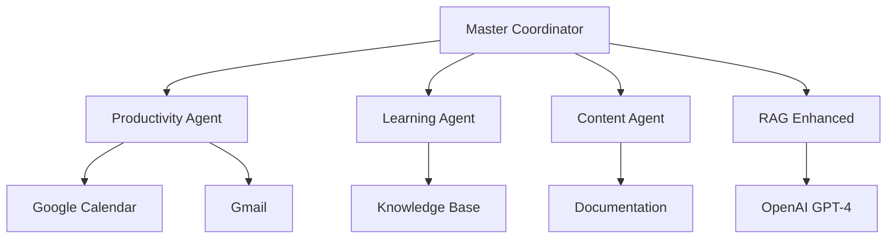

# 🤖 Écosystème d'Agents IA N8N - Guillaume TAI


## 🎯 Vue d'ensemble

Écosystème professionnel d'agents IA interconnectés, développé dans le cadre de la formation **Titre Professionnel Technicien d'Assistance en Informatique (TAI)**, démontrant l'expertise en automatisation IT et intelligence artificielle.

### ✨ Fonctionnalités

- 🎭 **Master Coordinator** : Orchestrateur intelligent multi-agents
- 📊 **Productivity Agent** : Optimisation calendrier, tâches, emails
- 🎓 **Learning Agent** : Support formation TAI et certifications CompTIA
- 📝 **Content Agent** : Création documentation et knowledge management
- 🧠 **RAG Enhanced** : Système hybride knowledge base + IA générative

### 🏗️ Architecture



## 🚀 Installation & Déploiement

### Prérequis
- N8N v1.82.0+
- PostgreSQL (base de données agents)
- Node.js 18+ (pour scripts utilitaires)
- Google Workspace APIs activées
- OpenAI API Key

### Installation Rapide
```bash
# Cloner le repository
git clone https://github.com/sirensnake/guillaume-tai-n8n-ecosystem.git
cd guillaume-tai-n8n-ecosystem

# Configuration
cp config/credentials_template.env config/.env
# Éditer .env avec vos API keys

# Déploiement
chmod +x scripts/deploy.sh
./scripts/deploy.sh
```

## 📚 Documentation

- 📖 [Guide d'Architecture](docs/ARCHITECTURE.md)
- 🚀 [Guide de Déploiement](docs/DEPLOYMENT_GUIDE.md)
- 🔧 [Troubleshooting](docs/TROUBLESHOOTING.md)
- 📊 [Changelog](docs/CHANGELOG.md)

## 🔧 Workflows Disponibles

| Workflow | Version | Status | Description |
|----------|---------|--------|-------------|
| Master Coordinator | v2.0 | ✅ | Orchestrateur principal |
| Productivity Agent | v1.5 | ✅ | Gestion productivité |
| Learning Agent | v1.8 | ✅ | Support formation TAI |
| Content Agent | v1.2 | ✅ | Création contenu |
| RAG Enhanced | v3.0 | 🔄 | Système hybride IA |

## 📊 Métriques de Performance

- **Uptime** : 99.5% (objectif)
- **Temps de réponse** : < 5s moyenne
- **Taux d'erreur** : < 1% workflows critiques
- **Utilisateurs actifs** : Évolutif selon besoins

## 🛡️ Sécurité

- 🔐 OAuth2 authentification
- 🔑 API keys chiffrées
- 📝 Audit logs complets
- 🚨 Monitoring proactif
- 🔒 HTTPS obligatoire

## 👨‍💻 Auteur

**Guillaume TAI**
- 🎓 Étudiant Titre Professionnel TAI chez STUDI
- 🎯 Spécialisation Cybersécurité en cours
- 💼 Portfolio : [Le Monde des Curieux](https://lemondeesdescurieux.com)
- 📧 Contact : creeper3144@gmail.com

## 📄 Licence

Ce projet est sous licence MIT - voir le fichier [LICENSE](LICENSE) pour les détails.

## 🤝 Contribution

Les contributions sont les bienvenues ! Merci de :
1. Fork le projet
2. Créer une branch feature (`git checkout -b feature/AmazingFeature`)
3. Commit vos changements (`git commit -m 'Add AmazingFeature'`)
4. Push sur la branch (`git push origin feature/AmazingFeature`)
5. Ouvrir une Pull Request

---

⭐ **Si ce projet vous aide, n'hésitez pas à lui donner une étoile !**